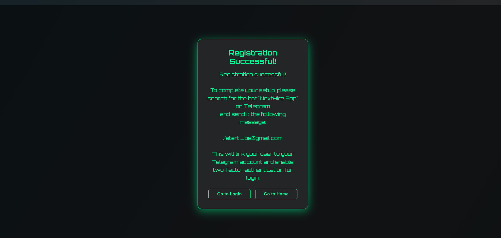
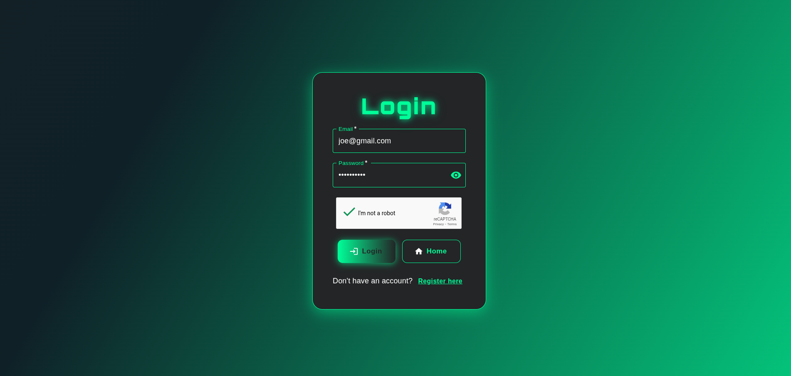
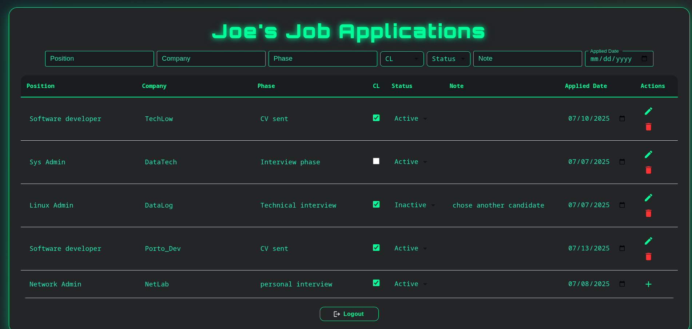
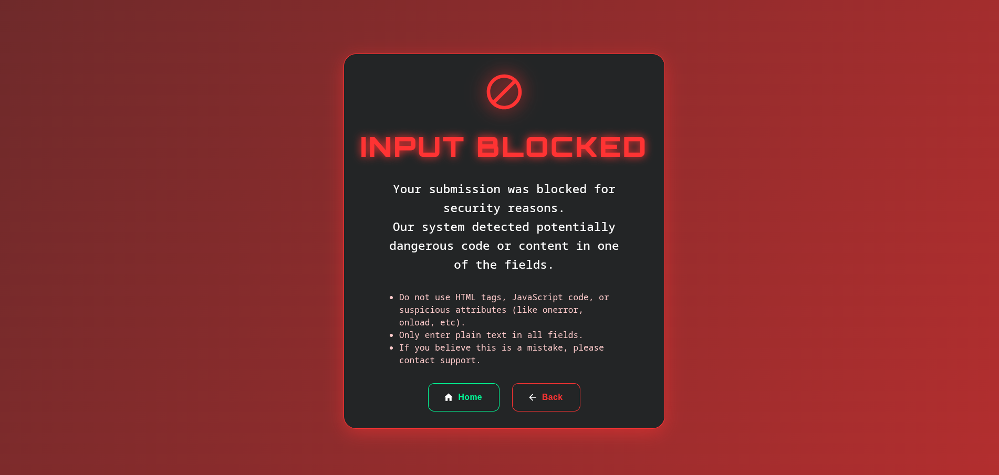

# NextHire 📑💼

## Project Overview
A full-stack application to track job applications, featuring a robust REST API (Node.js/Express/MongoDB) and a modern React frontend.

---

## Security Implementation
NextHire was built with security as a top priority. Here’s what protects your data and users:

### Backend Security
- **JWT Authentication**: All protected routes require a valid token.
- **Rate Limiting**: Prevents brute-force and abuse attacks.
- **2FA (Two-Factor Authentication)**: Required for login.
- **Input Sanitization & Malicious Input Detection**: All user input is sanitized and checked for XSS, SQL injection, and other attacks. Dangerous code or patterns are blocked immediately. After detection, the request is rejected and the user is notified.
- **Login/2FA Attempt Tracking**: Middleware tracks failed attempts and enforces lockouts.
- **Access Control**: Users can only access their own data; unauthorized access attempts are denied.
- **Data Validation**: All critical routes use express-validator for strict data validation.
- **Helmet**: Sets secure HTTP headers.
- **CORS**: Only allows requests from the authorized frontend.

---

## Features
### Backend
- **Express Server**: Secure API with authentication, rate limiting, 2FA, and attempt tracking.
- **REST API**: Endpoints for users and job applications.
- **MongoDB**: NoSQL database for persistence.

### Frontend
- **React**: Modern SPA with protected navigation.
- **Material UI**: Responsive, stylish UI.
- **Recaptcha**: Integrated with Google Recaptcha for bot protection.
- **API URL Configurable**: Uses `REACT_APP_API_URL` from .env for backend communication.

---

## Environment Variables

### Backend (`backend/.env`)
- `PORT`: Port for the backend server (e.g., 8443)
- `REACT_APP_API_URL`: API URL for frontend-backend communication
- `MONGO_URL`: MongoDB connection string
- `JWT_SECRET_KEY`: Secret for JWT authentication
- `DB_NAME`: MongoDB database name
- `EMAIL_USER` / `EMAIL_PASS`: Credentials for sending emails
- `TELEGRAM_BOT_TOKEN`: Telegram bot token for admin alerts
- `MASTER_EMAIL`: Admin email address
- `RECAPTCHA_SECRET_KEY`: Google Recaptcha secret key

### Frontend (`frontend/.env`)
- `REACT_APP_API_URL`: Backend API URL
- `REACT_APP_RECAPTCHA_SITE_KEY`: Google Recaptcha site key

> **Note:** Never commit real secrets or production credentials to public repositories. The above are example keys/values.

---

## Screenshots

### Home Page


### Successful Registration


### Login Page


### Job Applications Dashboard


### Access Denied


### Input Blocked (Malicious Input)


---

## Project Structure
```
backend/
  models/           # Mongoose models (User, Job)
  routes/           # Express routes (userRoutes, jobRoutes)
  middlewares/      # Security middlewares
  utils/            # Utilities (argon, telegram)
  db.js             # MongoDB connection
  index.js          # Entry point
frontend/
  src/
    components/     # React components (Login, Register, Profile, etc)
    App.js          # Root component
    index.js        # Entry point
  public/           # index.html, manifest
imgs/               # Screenshots for documentation
```

---

## Getting Started
### Prerequisites
- Node.js >= 18
- MongoDB (local or Atlas)

### Installation
1. Clone the repository:
    ```sh
    git clone https://github.com/hugo8072/NextHire.git
    cd NextHire
    ```
2. Install backend and frontend dependencies:
    ```sh
    cd backend && npm install
    cd ../frontend && npm install
    ```
3. Create the `.env` files in `backend/` and `frontend/` as described above.

### Running
- **Backend:**
    ```sh
    cd backend
    npm start
    ```
- **Frontend:**
    ```sh
    cd frontend
    npm start
    ```

---

## API Endpoints (Main)
- `GET /api/users` — List users
- `POST /api/users/register` — Register
- `POST /api/users/login` — Login
- `POST /api/users/verify` — 2FA
- `GET /api/jobs` — List job applications
- `POST /api/jobs` — Create job application

---

## Contribution
Contributions are welcome! Fork and submit a pull request.

## License
MIT


